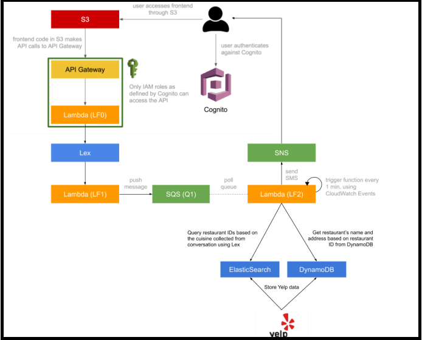
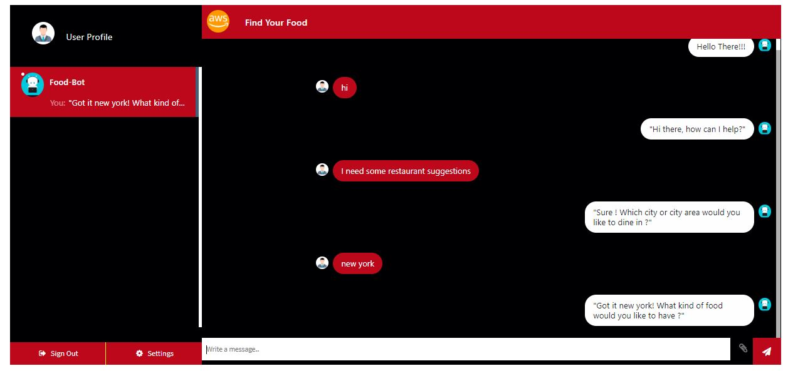
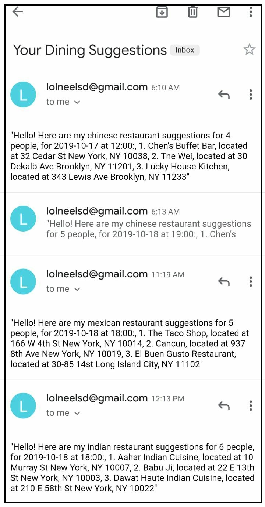

# Find-Your-Food (Dining-Chatbot)
## ABOUT
"Find your Food" is a serverless, microservice driven web-based application. It is an intelligent natural language powered chat-bot that is designed to provide restaurant suggestions based on your requirements such as - City, Time, Number of people, Cuisine Type and Date. The bot uses the yelp API to fetch relevant suggestions and mails the suggestions on the email-id that the user provides. 
## FRONTEND (HTML, JavaScript, CSS)
The frontend is hosted in AWS S3 and provides a web-app user interface to interact with the chat bot.Many  open source libraries and frameworks were used to design the UI/UX of the bot. A similar template of my web-application can be found at: https://bootsnipp.com/snippets/exR5v
## DESCRIPTION
"Find your Food" is a serverless, microservice driven web-based application. It is an intelligent natural language powered chat-bot that is designed using multiple AWS components such as:-
##### AWS Lex, S3-Buckets, API-Gateway, Swagger, Lambda Functions, Cognito, DynamoDB, SQS, Cloud Watch and Elastic Search.

This chatbot can help you provide restaurant suggestions based on your requirements such as - City, Time, Number of people, Cuisine Type and Date. The bot uses the yelp API to fetch relevant suggestions and mails the suggestions on the email-id that the user provides. 
 
 ## ARCHITECHTURE :- 
 

## SAMPLE UI OF THE WEB APPLICATION

## SAMPLE OUTPUT - The user recieves an email of the suggestions :- 

 

